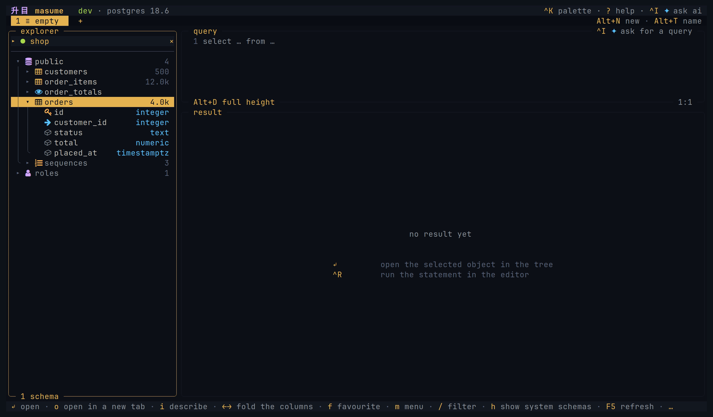
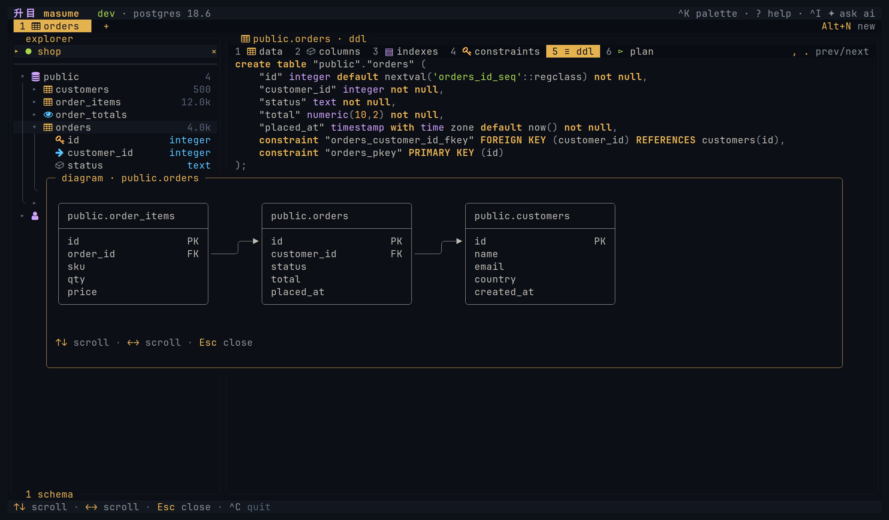
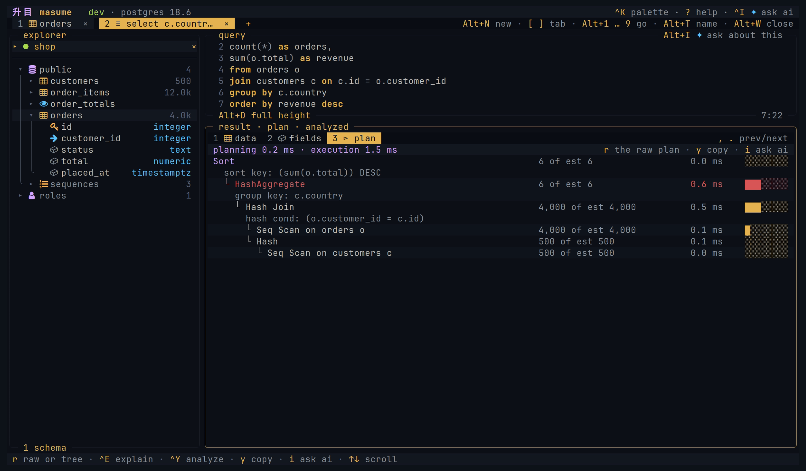

<h1 align="center">升目 masume</h1>

<h3 align="center">A keyboard-first terminal database client with AI chat and an MCP server</h3>

<p align="center">
  <a href="https://github.com/masumedb/masume/actions/workflows/check.yml"></a>
  
  
</p>

<p align="center">
  <code>mise use -g github:masumedb/masume@latest</code>
</p>

<p align="center">
  
</p>

---

### Browse

The object tree lists the database objects. Table views show data, columns, indexes, constraints, DDL, and query plans.



### Diagram

An ER diagram shows a table and the tables linked to it by foreign keys.



### Query

The editor has syntax highlighting and completion from the database catalog. Local checks, and server checks where the engine supports them, mark errors before execution. A statement without a diagnostic can still fail.


### Results

Sort, filter, follow a foreign key, or freeze a column. Grid edits stay staged until the SQL is reviewed and run. Masking hides columns with sensitive names in the grid only. Copies, exports, and value viewers show the original values.


### Explain

Query plans are drawn as a tree with estimated or measured costs.



### Notebooks

A notebook contains cells of prose, values, statements, and charts on one connection. Each cell keeps its result and its view. A notebook is a Markdown file, and `masume nb run` runs it.


### Agents

masume has a built-in AI chat and an MCP server over stdio. The AI chat uses the current connection and asks for confirmation before each query, including reads. The MCP server opens its own connections to the allowed profiles. Its access levels and the profile settings apply to its queries and write confirmations.

Both use the same database tools with different policies. See [AI data sharing](docs/ai.md), [MCP access](docs/mcp.md), and [security limits](SECURITY.md).

---

## Features

**Multiple engines:** PostgreSQL, MySQL, SQL Server, ClickHouse, SQLite, Cassandra, Redis, and MongoDB. Hosted services based on them also work.

**Staged edits:** Insert, edit, duplicate, and delete rows in supported tables, then review the SQL. See [editing rows](docs/usage.md#editing-rows).

**Filters:** Server predicates and filters on loaded rows. See [sorting and filters](docs/usage.md#sorting-and-filters).

**Named parameters:** A statement with `:name` placeholders opens a form for the values.

**Export and copy:** CSV and JSON files. Clipboard formats also include Markdown, `INSERT` statements, row JSON, and column `IN` clauses. See [copy and export](docs/usage.md#copy-and-export).

**Dump and restore:** Schema and data as a SQL file. See [dump and restore](docs/usage.md#dump-and-restore).

**Import:** CSV or JSON into an existing or new SQL table. See [importing files](docs/usage.md#importing-files).

**Query history and saved queries:** Statement history and named queries. Restored tabs keep the query text and settings, but not the result rows.

**Write plans:** Counts and reverse SQL for supported writes. See [write plans](docs/configuration.md#write-plans).

**Transactions:** Begin, commit, and rollback. With autocommit off, running a statement starts a transaction.

**Server dashboard:** Sessions and metrics the engine supports. See [server activity](docs/usage.md#server-activity).

**Password sources:** Prompt, keyring, environment variables, commands, and named secret stores. Profile files do not store database passwords. See [credentials](SECURITY.md#credentials).

**Read-only profiles:** Checked in the client, and also enforced by the server on engines that support it. See [read-only access](docs/engines.md#read-only-access).

**MCP server:** `masume --mcp` serves the selected profiles over stdio, with an access level per profile and one for the whole server.

**AI chat:** Questions about a statement, its error, or its query plan. Anthropic, OpenAI, Grok, and OpenAI-compatible providers, or a coding agent such as Claude Code. `[ai] enabled = false` hides the chat.

**MongoDB:** A [subset of shell syntax](docs/engines.md#mongodb).

**Redis:** [Commands in a query tab](docs/engines.md#redis), one per line.

**Cassandra:** [CQL with the keyspace as the schema](docs/engines.md#cassandra).

**Themes:** Built-in themes, custom themes, or terminal colours.

**Project profiles:** Shared connections and saved queries in the nearest `.masume.toml`. See [project file](docs/configuration.md#project-file).

---

## Install

Each command below installs the latest tagged release. The packages and archives are on the [releases page](https://github.com/masumedb/masume/releases/latest).

### Script

```sh
curl -fsSL https://raw.githubusercontent.com/masumedb/masume/master/install.sh | sh
```

The script installs `masume` to `~/.local/bin`.

### Homebrew

```sh
brew install masumedb/tap/masume
```

### Scoop

```powershell
scoop bucket add masumedb https://github.com/masumedb/scoop-bucket
scoop install masumedb/masume
```

### mise

```sh
mise use -g github:masumedb/masume@latest
```

### npm

```sh
npm install -g masume
```

`npx masume` runs masume without installing it.

### Debian and Ubuntu

```sh
sudo dpkg -i masume_0.0.4_linux_amd64.deb  # adapt the version and the architecture
```

### Fedora and RHEL

```sh
sudo rpm -i masume_0.0.4_linux_amd64.rpm  # adapt the version and the architecture
```

### Alpine

The packages are unsigned. `apk` needs `--allow-untrusted`.

```sh
sudo apk add --allow-untrusted masume_0.0.4_linux_amd64.apk  # adapt the version and the architecture
```

### Archive

Unpack the `tar.gz` for the platform, or the `zip` on Windows. Put `masume` on the PATH.

### Go

```sh
go install github.com/masumedb/masume@latest
```

Builds from the module proxy. Requires Go 1.27 or later.

### From source

```sh
git clone https://github.com/masumedb/masume.git
cd masume
mise install
mise run install
```

## Usage

```text
masume                                  open the client
masume TARGET                           open a connection, postgres://you@host/shop
masume --profile NAME                   open a user or project profile
masume --detect                         open detected container databases
masume run [TARGET | -p NAME] STATEMENT run statements
masume nb run [TARGET | -p NAME] FILE   run a notebook
masume dump [TARGET | -p NAME] FILE     dump schema and data
masume restore [TARGET | -p NAME] FILE  restore a dump
masume --mcp                            serve allowed MCP profiles
masume --mcp --profile=NAME             serve one allowed MCP profile
masume --mcp --check                    check enabled MCP profiles
masume --version                        print the version
```

With no target or profile, masume opens `$DATABASE_URL`.

URL support is partial: most native driver options are ignored. See [connection targets](docs/usage.md#connection-targets).

### Headless mode

```sh
masume run -p shop-prod -f json 'select count(*) from orders'
masume run -p shop -e ./reports/daily.sql --param day=2026-09-02
masume run ./notes.db -f csv 'select * from notes limit 100000' > notes.csv
```

See [headless mode](docs/headless.md) for formats, exit codes, dump, restore, and notebooks.

### For teams

A repository can contain `.masume.toml` with shared profiles and queries:

```toml
[profile.dev]
engine   = "postgres"
host     = "127.0.0.1"
database = "shop"
user     = "shop"
env      = "dev"

[query.recent-orders]
sql         = "select * from orders order by created_at desc limit 50"
description = "the newest 50 orders"
```

masume reads the nearest project file in or above the working directory. See [project file](docs/configuration.md#project-file) and [project security](SECURITY.md#project-files).

## First connection

The quickest way to connect is a URL on the command line:

```sh
masume postgres://ada@127.0.0.1:5432/shop
```

The first interactive run creates a starter configuration file if none exists. In the picker, `n` adds a profile, and `Ctrl+N` returns to the picker from a connection. Profiles can also be written by hand in the configuration file:

```toml
[profile.shop]
engine   = "postgres"
host     = "127.0.0.1"
port     = 5432
database = "shop"
user     = "ada"
auth     = "prompt"
env      = "dev"
mode     = "write"
```

`auth = "prompt"` prompts for the password at connection time. The password is kept only in memory unless it is saved to the keyring.

## Docs

| Page | About |
| --- | --- |
| [User guide](docs/usage.md) | Workflows, navigation, editing, data transfer, and troubleshooting |
| [Notebooks](docs/notebooks.md) | Cells, charts, run policy, the file format, and `masume nb run` |
| [Configuration](docs/configuration.md) | Settings, defaults, profiles, and password sources |
| [Engines](docs/engines.md) | Protocols and capabilities |
| [Keys](docs/keys.md) | Default bindings, scopes, and overrides |
| [Themes](docs/themes.md) | Built-in and custom themes |
| [AI chat](docs/ai.md) | Providers, tools, and data sent to the provider |
| [MCP server](docs/mcp.md) | Tools, limits, and write confirmation |
| [Headless mode](docs/headless.md) | `masume run` for scripts and CI |
| [Security](SECURITY.md) | Storage, data sharing, and protection limits |

## Contributing

See [CONTRIBUTING.md](CONTRIBUTING.md).

## License

Apache License 2.0. See [LICENSE](LICENSE).