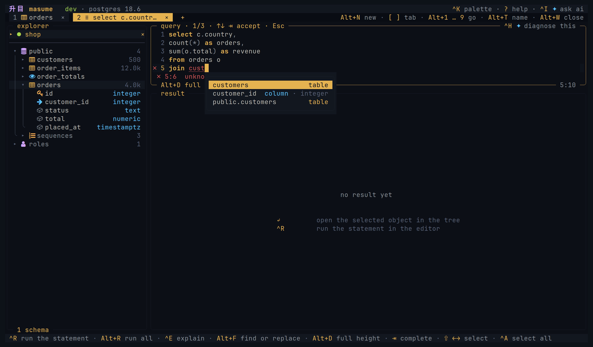
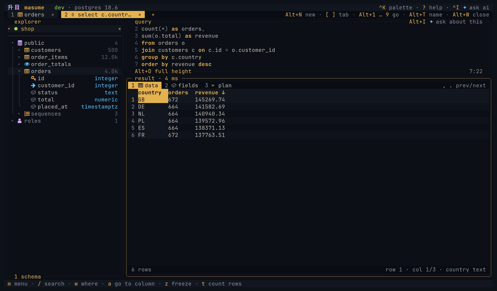
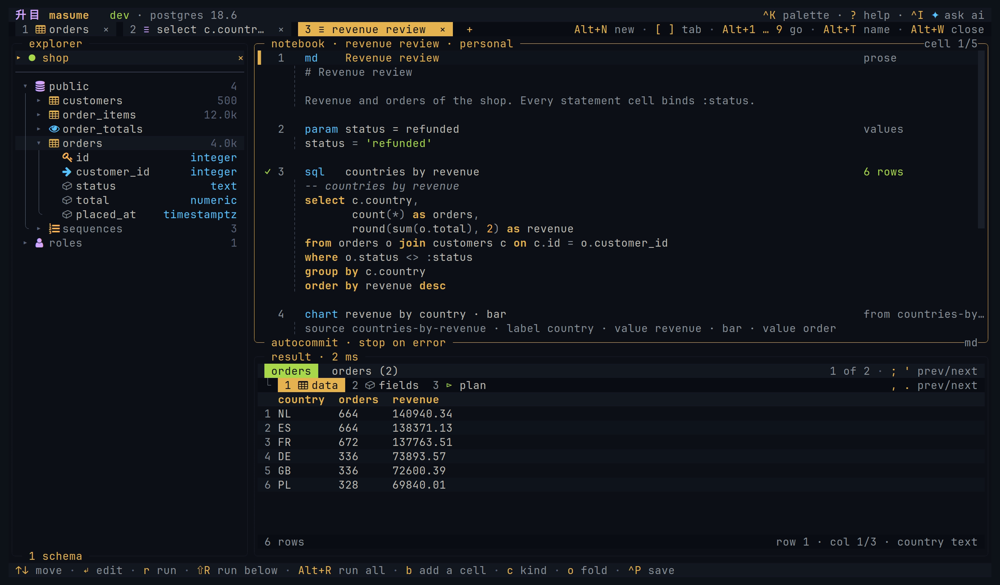
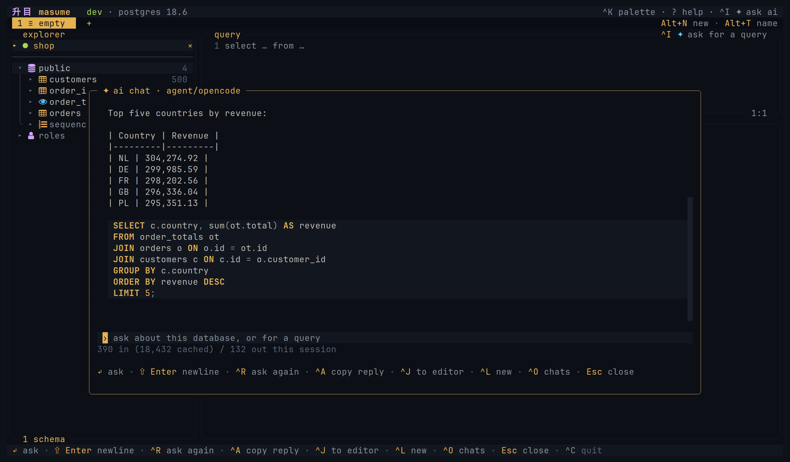

<h1 align="center">升目 masume</h1>

<h3 align="center">A keyboard-first terminal database client with AI chat and an MCP server</h3>

<p align="center">
  <a href="https://github.com/masumedb/masume/actions/workflows/check.yml"></a>
  
  
</p>

<p align="center">
  
</p>

**Engines:** PostgreSQL, MySQL, MariaDB, SQL Server, ClickHouse, SQLite, Cassandra, ScyllaDB, Redis, MongoDB, and hosted services such as Neon, Supabase, PlanetScale, Turso, Redshift, and Amazon DocumentDB. See the [full list](docs/engines.md#protocols).

## Install

**mise**

```sh
mise use -g github:masumedb/masume@latest
```

Update: `mise upgrade github:masumedb/masume`

**npm** (`npx masume` runs without installing)

```sh
npm install -g masume
```

Update: `npm update -g masume`

**Go** (Go 1.27 or later)

```sh
go install github.com/masumedb/masume@latest
```

Update: run the same command again.

**Homebrew**

```sh
brew install masumedb/tap/masume
```

Update: `brew upgrade masumedb/tap/masume`

**Scoop**

```powershell
scoop bucket add masumedb https://github.com/masumedb/scoop-bucket
scoop install masumedb/masume
```

Update: `scoop update` then `scoop update masume`

**Script** (installs to `~/.local/bin`)

```sh
curl -fsSL https://raw.githubusercontent.com/masumedb/masume/master/install.sh | sh
```

Update: run the script again. masume does not update itself.

**Debian and Ubuntu**

```sh
sudo dpkg -i masume_<version>_linux_<arch>.deb
```

Update: install the newer package with the same command.

**Fedora and RHEL**

```sh
sudo rpm -i masume_<version>_linux_<arch>.rpm
```

Update: `sudo rpm -U masume_<version>_linux_<arch>.rpm`

**Alpine** (the packages are unsigned)

```sh
sudo apk add --allow-untrusted masume_<version>_linux_<arch>.apk
```

Update: install the newer package with the same command.

**From source**

```sh
git clone https://github.com/masumedb/masume.git
cd masume
mise install
mise run install
```

Update: `git pull`, then `mise run install`.

The packages and archives are on the [releases page](https://github.com/masumedb/masume/releases/latest). For an archive, unpack the `tar.gz`, or the `zip` on Windows, and put `masume` on the PATH.

## Quick start

```sh
masume
```

`masume` opens the connection picker. `n` adds a profile, and Enter connects. `Ctrl+N` returns to the picker from a connection. `?` shows the keys, and `Ctrl+K` opens the command palette. When `$DATABASE_URL` is set, `masume` opens that connection instead.

A connection can also come from the command line:

- `masume postgres://ada@127.0.0.1:5432/shop` opens a URL.
- `masume ./notes.db` opens a SQLite file.
- `masume --detect` lists the databases in running Docker or Podman containers.

The first interactive run creates a starter configuration file. A profile can also be written by hand:

```toml
[profile.shop]
engine   = "postgres"
host     = "127.0.0.1"
port     = 5432
database = "shop"
user     = "ada"
auth     = "prompt"
env      = "dev"
mode     = "write"
```

`auth = "prompt"` prompts for the password at connection time. The password is kept only in memory unless it is saved to the keyring. See [configuration](docs/configuration.md) for every setting.

## Features

### Browse and query

The object tree lists the database objects. Table views show data, columns, indexes, constraints, DDL, and query plans. An ER diagram shows a table and the tables linked to it by foreign keys.

The editor has syntax highlighting and completion from the database catalog. Local checks, and server checks where the engine supports them, mark errors before execution. A statement with `:name` placeholders opens a form for the values. Query plans are drawn as a tree with estimated or measured costs.

A query builder tab writes a select from tables, joins, and filters. Query history and saved queries keep the statements. MongoDB takes a [subset of shell syntax](docs/engines.md#mongodb), Redis takes [commands, one per line](docs/engines.md#redis), and Cassandra takes [CQL with the keyspace as the schema](docs/engines.md#cassandra).



### Results and editing

- **Grid:** sort, filter on the server or on loaded rows, follow a foreign key, or freeze a column. See [sorting and filters](docs/usage.md#sorting-and-filters).
- **Staged edits:** insert, edit, duplicate, and delete rows in supported tables, then review the SQL before it runs. See [editing rows](docs/usage.md#editing-rows).
- **Write plans:** row counts and reverse SQL for supported writes. See [write plans](docs/configuration.md#write-plans).
- **Transactions:** begin, commit, and rollback. With autocommit off, running a statement starts a transaction.
- **Masking:** hides columns with sensitive names in the grid only. Copies, exports, and value viewers show the original values.
- **Copy and export:** CSV and JSON files. Clipboard formats also include Markdown, `INSERT` statements, row JSON, and column `IN` clauses. See [copy and export](docs/usage.md#copy-and-export).
- **Import:** CSV or JSON into an existing or new SQL table. See [importing files](docs/usage.md#importing-files).
- **Dump and restore:** schema and data as a SQL file. See [dump and restore](docs/usage.md#dump-and-restore).
- **Server dashboard:** sessions and metrics the engine supports. See [server activity](docs/usage.md#server-activity).



### Notebooks

A notebook contains cells of prose, values, statements, and charts on one connection. Each cell keeps its result and its view. A notebook is a Markdown file, and `masume nb run` runs it. See [notebooks](docs/notebooks.md).



### AI chat and MCP server

The AI chat uses the current connection and asks for confirmation before each query, including reads. It works with Anthropic, OpenAI, Grok, and OpenAI-compatible providers, or a coding agent such as Claude Code. `[ai] enabled = false` hides the chat. See [AI chat](docs/ai.md).

`masume --mcp` serves the allowed profiles to an external agent over stdio. It opens its own connections, with an access level per profile and one for the whole server. See [MCP server](docs/mcp.md).

Both use the same database tools with different policies. See [security limits](SECURITY.md).



### Connections and teams

- **Password sources:** prompt, keyring, environment variables, commands, and named secret stores. Profile files do not store database passwords. See [credentials](SECURITY.md#credentials).
- **Read-only profiles:** checked in the client, and also enforced by the server on engines that support it. See [read-only access](docs/engines.md#read-only-access).
- **SSH tunnels and unix sockets:** see [SSH tunnel](docs/configuration.md#ssh-tunnel) and [unix socket](docs/configuration.md#unix-socket).
- **Container detection:** `masume --detect` finds databases in running Docker or Podman containers. See [databases in a container](docs/usage.md#databases-in-a-container).
- **Themes:** built-in themes, custom themes, or terminal colours. See [themes](docs/themes.md).

A repository can share connections and saved queries in `.masume.toml`. masume reads the nearest one in or above the working directory:

```toml
[profile.dev]
engine   = "postgres"
host     = "127.0.0.1"
database = "shop"
user     = "shop"
env      = "dev"

[query.recent-orders]
sql         = "select * from orders order by created_at desc limit 50"
description = "the newest 50 orders"
```

See [project file](docs/configuration.md#project-file) and [project security](SECURITY.md#project-files).

### Headless mode

```sh
masume run -p shop-prod -f json 'select count(*) from orders'
masume run -p shop -e ./reports/daily.sql --param day=2026-09-02
masume run ./notes.db -f csv 'select * from notes limit 100000' > notes.csv
```

See [headless mode](docs/headless.md) for formats, exit codes, dump, restore, and notebooks.

## Command line

```text
masume                                  open the client
masume TARGET                           open a connection, postgres://you@host/shop
masume --profile NAME                   open a user or project profile
masume --detect                         open detected container databases
masume run [TARGET | -p NAME] STATEMENT run statements
masume nb run [TARGET | -p NAME] FILE   run a notebook
masume dump [TARGET | -p NAME] FILE     dump schema and data
masume restore [TARGET | -p NAME] FILE  restore a dump
masume --mcp                            serve allowed MCP profiles
masume --mcp --profile=NAME             serve one allowed MCP profile
masume --mcp --check                    check enabled MCP profiles
masume --version                        print the version
```

URL support is partial: most native driver options are ignored. See [connection targets](docs/usage.md#connection-targets).

## Docs

| Page | About |
| --- | --- |
| [User guide](docs/usage.md) | Workflows, navigation, editing, data transfer, and troubleshooting |
| [Notebooks](docs/notebooks.md) | Cells, charts, run policy, the file format, and `masume nb run` |
| [Configuration](docs/configuration.md) | Settings, defaults, profiles, and password sources |
| [Engines](docs/engines.md) | Protocols and capabilities |
| [Keys](docs/keys.md) | Default bindings, scopes, and overrides |
| [Themes](docs/themes.md) | Built-in and custom themes |
| [AI chat](docs/ai.md) | Providers, tools, and data sent to the provider |
| [MCP server](docs/mcp.md) | Tools, limits, and write confirmation |
| [Headless mode](docs/headless.md) | `masume run` for scripts and CI |
| [Security](SECURITY.md) | Storage, data sharing, and protection limits |

## Contributing

See [CONTRIBUTING.md](CONTRIBUTING.md).

## License

Apache License 2.0. See [LICENSE](LICENSE).
