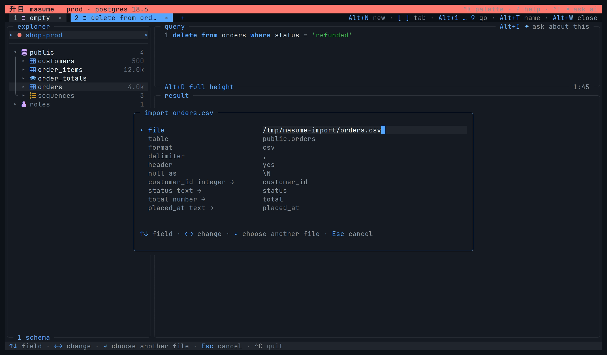

# User guide

This guide covers the interactive terminal client. The [key reference](keys.md) lists every default binding and its focus scope.

## First connection

Run `masume` to open the connection picker. Select a profile with Up and Down. Press Enter.

The picker has a filter field above the list, and `/` focuses the field. The filter matches the name, the environment, the engine, and the target. Up, Down, and Enter continue to work while the field has the focus; Esc unfocuses the field and keeps the filter.

`n` opens a new connection form. `e` edits the selected profile. In the form, `Ctrl+T` tests the connection. `Ctrl+S` saves the profile. The `ssh tunnel` toggle shows the SSH fields. See [SSH tunnel](configuration.md#ssh-tunnel).

An explicit target or `$DATABASE_URL` can open a connection directly. See [connection targets](#connection-targets), [container detection](#databases-in-a-container), and [passwords](configuration.md#passwords).

A connection without restored tabs starts with an empty query tab. Focus moves to the object tree. `Tab` and `Shift+Tab` move between visible panes. `Alt+P s` focuses the tree. `Alt+P e` focuses the editor. `Alt+P r` focuses results.

The tree draws every schema of the server, including a schema that holds no relation. A MySQL-family or ClickHouse profile that names a database draws that database alone; a MySQL-family profile without one draws every database of the server. See [profiles](configuration.md#profiles).

In the tree, arrows move, expand, and collapse nodes. `Enter` on a table opens its rows or reuses its open tab. `o` opens another tab for that table. `i` opens the Columns view. `Enter` on a column inserts its qualified name into a query editor.

`/` filters the tree. Enter keeps the filter. Esc clears the active filter entry. A filter started inside a schema searches that schema. `f` toggles a favourite. `h` toggles system schemas. `F5` refreshes the catalog.

`m` opens the object menu. The entries include SQL templates, table changes, imports, and an ER diagram. SQL templates enter the editor without execution. The actions depend on the object and the engine.

## Connection targets

masume accepts a URL, a keyword connection string, or an existing SQLite file. These open a connection without a saved profile. `--profile NAME` opens a user or project profile instead. A connection argument and `--profile` cannot appear together. With neither, masume opens `$DATABASE_URL`.

```sh
masume 'postgres://reader@db.internal:5432/shop?sslmode=verify-full'
masume "host=db.internal port=5432 dbname=shop user=reader sslmode=require"
masume ./notes.db
masume --profile shop-prod
```

| Form | Read as |
| --- | --- |
| A URL | Supported schemes: `postgres`, `postgresql`, `mysql`, `mariadb`, `cockroachdb`, `redshift`, `sqlserver`, `mssql`, `clickhouse`, `libsql`, `redis`, `rediss`, `mongodb` |
| A connection string | `key=value` pairs: `engine`, `host`, `hostaddr`, `port`, `dbname`, `database`, `user`, `password`, `sslmode`. The default engine is `postgres` |
| A file path | A SQLite path ending in `.db`, `.db3`, `.sqlite` or `.sqlite3`. Other extensions must have an existing SQLite header. `:memory:` is also accepted |

A URL without a database uses the user name on PostgreSQL-family engines, database `0` on Redis, and `admin` on MongoDB. A MySQL-family URL without a database opens the server itself, and every other engine must have the database in the URL. A missing URL host uses `127.0.0.1`.

Connection strings accept single-quoted values and backslash escapes inside quotes. `engine` accepts the profile engine names; unknown connection string keys are errors.

URLs support one host, credentials, a port, a database, and `sslmode`, `ssl-mode`, or `sslMode`. Other native URL options are ignored; these include `authSource`, `replicaSet`, and `connect_timeout`. The client rejects `mongodb+srv` URLs.

`rediss://` connects with TLS and verifies the certificate. Other settings use new-connection defaults; they include `env = "dev"`, `mode = "write"`, and `page_size = 200`.

The client asks for a missing password when the engine and the user need one. SQLite and MongoDB without a user need no password. The connection stays in memory until saved; the picker uses the database name or file name and adds a numeric suffix for duplicate names.

## Databases in a container

```sh
masume --detect
```

`--detect` reads running containers through `docker`, and it uses `podman` if Docker is absent. Detected databases appear before saved profiles in the connection picker; detection does not write the configuration file.

A container appears when both are true:

- The image name contains a supported database name. Recognized names are `postgres`, `postgis`, `pgvector`, `timescale`, `supabase`, `cockroach`, `mysql`, `percona`, `mariadb`, `tidb`, `redis`, `valkey`, and `mongo`. Detection uses the image name, not the parent image. `supabase/postgres` is Supabase.
- The container publishes the database port.

Detection reads the user, database, and password from container environment variables:

| Engine | Variables |
| --- | --- |
| PostgreSQL | `POSTGRES_USER`, `POSTGRES_DB`, `POSTGRES_PASSWORD` |
| MySQL | `MYSQL_USER`, `MYSQL_PASSWORD`, `MYSQL_DATABASE`, `MYSQL_ROOT_PASSWORD` |
| MariaDB | The MySQL names with a `MARIADB_` prefix, with MySQL variables as fallbacks |
| MongoDB | `MONGO_INITDB_ROOT_USERNAME`, `MONGO_INITDB_ROOT_PASSWORD`, `MONGO_INITDB_DATABASE` |
| Redis | `REDIS_PASSWORD` |
| CockroachDB | `COCKROACH_USER`, `COCKROACH_PASSWORD`, `COCKROACH_DATABASE` |

Missing variables use the detection defaults. A PostgreSQL container with only `POSTGRES_DB` set uses the `postgres` user.

Detected connections use `env = "dev"` and `mode = "write"`. Hosted-service images such as `supabase/postgres` use `sslmode = "prefer"` instead of the engine default `require`.

`--detect` exits with code 1 if neither tool is present, if detection fails, or if no supported database is found. `--detect` cannot be combined with a target or `--profile`; an explicit target or profile takes priority over `$DATABASE_URL`.

## Temporary connections

A command-line or detected connection is temporary. On exit, masume asks whether to save each temporary connection that was opened:

```
┌─ save connection ─────────────────────────────┐
│ Write "shop" to the config file?              │
│                                               │
│ shop  postgres@db.internal:5432/shop          │
│                                               │
│ The password goes into the keyring, not the   │
│ file.                                         │
│                                               │
│ y save and quit · n quit without saving       │
└───────────────────────────────────────────────┘
```

`y` saves the connections and exits, and `n` exits without saving; `Esc` returns to the client. masume does not ask about saved profiles, project profiles, or unopened connections.

The password notice appears only for a password kept in memory; saving such a password uses the keyring and sets `auth = "keyring"`. Without a keyring, masume saves `auth = "prompt"` and does not store the password.

Press `Ctrl+N`, then `e` to open the selected connection in the form. `Ctrl+S` saves the profile. The exit prompt does not show that profile again. Selecting `auth = "prompt"` leaves a password already kept in memory, and saving can still store that password in the keyring.

A save error keeps the client open and displays the reason.

## Editing SQL

`Alt+N` opens a new query tab with editor focus. `Alt+E` opens a table read as a query. In a query tab, `Alt+E` writes the grid sort and server filters into the SQL.

Type SQL or use the terminal paste command. `Ctrl+V` pastes the system clipboard, and the terminal paste command does the same.

Completion appears while typing. Up and Down select a candidate, and Tab accepts the candidate. Enter always inserts a newline, even while completion is open. Esc dismisses completion; without completion, Tab changes panes.

Shift with movement keys extends the selection. `Ctrl+A` selects all editor text. `Ctrl+C` copies and clears the selection; without a selection, `Ctrl+C` quits after asking about staged changes and open transactions. `Ctrl+D` formats SQL. `Alt+C` toggles line comments. `Alt+[` or `Alt+]` changes indentation.

`Alt+F` opens Find. Enter applies the search. `F3` and `Shift+F3` select the next or previous match. The search uses plain substrings, including matches inside longer names.

For replacement, type the search term in Find, then press `Ctrl+R`. Type the replacement and press Enter. Replacement changes every match, and one editor undo reverses the whole replacement.

Search and replacement cover the whole editor buffer, including other statements, comments, and strings. Matching normally ignores case, but if lowercase conversion changes the byte length of the text, matching uses the original case.

`F8` moves to the next reported SQL problem. Editor undo is `Ctrl+Z`. Redo is `Ctrl+Shift+Z` or `Alt+Z`.

## Running SQL

`Ctrl+R` runs the selected text. If no text is selected, it runs the statement at the caret. A selection can contain several statements. `Alt+R` runs the entire buffer. On a table tab, either command reads the table again.

Statements run in order, and each has one result. The first failure stops the batch; later statements do not run. A batch is not automatically atomic. Without a transaction, earlier successful writes can remain after a later failure.

The result pane receives focus after editor execution. `;` and `'` select previous and next statement results outside text entry. The numbered result strip also accepts mouse clicks.

Named parameters such as `:customer_id` open a JSON value form before execution. `Ctrl+R` submits the values and Esc cancels. Each statement with parameters has its own form, and no statement runs until all parameter forms are complete.

Read-only profiles reject writes. Other profiles can ask for confirmation and show a write plan. Review the SQL and affected rows before accepting. See [write guards](configuration.md#profiles) and [write plans](configuration.md#write-plans).

`Ctrl+X` asks for query cancellation and stops an export in progress. Cancellation support depends on the engine. CockroachDB, MongoDB, PlanetScale, Redis, SQL Server, SQLite, and Turso take no cancel. The key is hidden there, and the wheel of the run shows `this engine cannot stop a running statement`. Query cancel is `Ctrl+X`. `Ctrl+C` copies or quits.

## Transactions

Transaction commands apply to the active connection and its other tabs as well. They need engine transaction support.

| Command | Key |
| --- | --- |
| Begin a transaction | `Ctrl+B` |
| Commit the transaction | `Ctrl+L` |
| Roll back the transaction | `Ctrl+U` |
| Toggle autocommit for this connection | `Ctrl+O` |

Begin a transaction before you run statements that must stay uncommitted. With autocommit off, masume begins a transaction before execution when none is active. Execution leaves that transaction open until an explicit commit or rollback closes it. The profile setting `autocommit = false` starts the connection in this mode.

This applies to editor queries, table reads, grid writes, undo, whole-query export, and AI chat `run_query`. Imports manage their own transactions and reject an open transaction. Catalog discovery and other AI chat tools do not automatically begin transactions. Headless and MCP execution have separate transaction behavior.

Changing autocommit does not commit an existing transaction or roll it back; commit or roll back explicitly. Engine restrictions still apply, including statements that implicitly commit.

## Result views

The result strip lists the views. Outside text entry, `1` through `9` select views by position, and comma and period select adjacent views. View positions depend on the tab, result, and engine.

Table tabs show Data, Columns, Indexes, Constraints, DDL, and Plan where supported. Query results show Data, Fields, and Plan where supported. Statements without result columns show Statistics, including affected rows and execution time.

Tree appears when a result contains documents or structured values. Left and Right collapse and expand nodes. Enter opens a node. `y` copies the value. `Shift+Y` copies its path. `/`, `u`, and `c` have the same search and reset behavior as the grid.

In Data, arrows move between cells. `v` opens the full cell value. Enter opens the full row. `g` follows a foreign key. `a` finds a column by name. `z` freezes or unfreezes the current column at the left.

Foreign-key navigation filters by the selected column only. For a composite foreign key, add filters for the remaining key columns.

A mask hides the values in columns with sensitive names. `M` toggles masking, which affects only the grid display. Cell viewers, row viewers, document trees, structured copies, and exports show the original values.

## Sorting and filters

Server operations run the read again, and screen filters only hide loaded rows; neither operation changes the editor text. `Alt+E` exposes server rewrites as SQL.

| Key | Operation |
| --- | --- |
| `s` | Sort by the current column; repeat to change direction |
| `S` | Add or change a column in the multi-column sort |
| `f` | Add a server filter equal to the current cell |
| `x` | Add a server filter excluding the current cell |
| `w` | Enter a server predicate; replace the previous raw predicate |
| `u` | Remove the last server filter and rerun |
| `F` | Select current-column values to keep on screen |
| `/` | Search loaded rows on screen |
| `c` | Clear grid sorting, all server filters, and all screen filters; rerun |

`f` and `x` add filters to a stack. `w` preserves those cell filters and replaces the existing raw predicate. An empty `w` entry removes the raw predicate. `u` removes only the last server filter. Sorting remains, and its rerun also clears screen filters. With no server filters, `u` does nothing. `c` does not remove clauses already written in the SQL.

A server filter searches the whole statement, not only the rows already fetched. A `LIMIT` written in the SQL applies to the filtered rows. The grid can show rows the unfiltered statement does not return.

In the `F` card, Space toggles a value. `o` keeps only the selected value, and `a` keeps all values. Enter applies the selection. Counts cover loaded rows before screen filtering. An empty `/` entry clears the screen search.

**Sorting, server filtering, and rerunning discard staged grid edits without asking.** The status bar reports the discarded changes. These operations also clear screen filters, so apply staged changes before them.

## Loading rows

`page_size` is the rows per page. The default is 200. When you move or scroll near the loaded end, the client fetches more rows automatically. The footer separates loaded rows, total rows when known, and rows shown after screen filtering.

An active screen filter disables automatic paging in both Data and Tree. `Ctrl+F` explicitly fetches another page, and this also works under a screen filter. `t` asks for a server count where supported. Counting does not load every row.

## Editing rows

Grid writes need a writable profile, a single identifiable table, loaded column metadata, and a primary key. Updates and deletes need every primary-key column in the result. Joins and other results without a single table cannot be edited, and views, materialized views, and generated columns are not editable through the grid.

| Key | Staged operation |
| --- | --- |
| `e` | Edit the current cell |
| `d` | Mark or unmark the current row for deletion |
| `D` | Duplicate the row without primary-key or generated columns |
| `n` | Enter a new row as JSON |
| `p` | Review staged SQL |
| `X` | Ask to discard all staged changes |

The cell editor shows choices for known enum and boolean columns. `Ctrl+S` stages the value. `Ctrl+L` stages NULL. `Ctrl+E` stages an empty value. `Ctrl+D` stages DEFAULT. `Ctrl+F` formats JSON in a JSON cell editor. These card keys do not run their global actions.

Staging does not write to the database. The right of the status bar counts the staged changes and names the key of the review, showing `● 3 staged · p to review`. In the review card, `Ctrl+Y` applies changes, `x` discards changes, and Esc returns without applying. A failed apply keeps the staged changes. Engines without atomic staged writes ask before applying multiple changes individually, and a failure can leave earlier changes written.

Staged changes belong to one statement result. Return to that result before applying, or discard the staged changes.

### Undo

| Operation | Effect |
| --- | --- |
| Editor `Ctrl+Z` | Reverses text edits only; redo with `Ctrl+Shift+Z` or `Alt+Z` |
| Grid `Ctrl+Z` | Reverses staged changes only; redo with `Ctrl+Shift+Z` or `Z` |
| Global `Alt+U` | Asks to execute reverse SQL kept by a write plan |

Neither editor undo nor grid undo reverses an executed database write. `Alt+U` needs a write-plan undo. Imports and staged grid writes do not create one. Transaction rollback is separate from all three operations. See [write plans](configuration.md#write-plans).

## Copy and export

`y` opens the grid copy menu. The forms are cell, row JSON, result CSV, result JSON, result Markdown, result INSERT statements, and column IN clause. `C c`, `C j`, `C m`, and `C i` copy whole loaded results directly. These sequences start with uppercase C.

Result and column copies include every loaded row, including rows hidden by screen filters. They use original values, ignore masks, and do not apply staged edits. Copies never fetch additional rows. INSERT copies need a table target.

`Ctrl+S` opens CSV file export. `Ctrl+G` opens JSON file export. Up and Down move between fields, and Left and Right change choices. Set the path and options, then press `Ctrl+S` to write. An existing file needs confirmation for overwrite.

| Row scope | Behavior |
| --- | --- |
| `loaded so far` | Writes loaded rows without another server read; the default |
| `every row` | Reruns the result's read and streams all returned rows |

Every-row export preserves the executed read, its server filters, sorting, and SQL limits. The second read can return newer data. Statements classified as writes permit loaded-row export only. Screen filters and masks affect neither export scope.

CSV options include delimiter, header, quoting, line endings, NULL text, and formula guarding. Defaults are comma, header enabled, as-needed quoting, LF, empty NULL text, and formula guarding enabled. CSV clipboard copies use these defaults.

Formula guarding prefixes risky text with an apostrophe. Risky prefixes are `=`, `+`, `-`, `@`, tab, and carriage return, while plain numbers remain unchanged.

Default CSV output cannot distinguish NULL from empty text. A custom `null as` value changes the NULL output, but import treats empty CSV fields as NULL even with a custom marker. See [Importing files](#importing-files).

Result JSON exports and copies preserve JSON nulls and native numeric and boolean values. Cell and row-menu copies use display text, and row-menu JSON is not the typed result JSON export.

## Importing files

Select a table in the object tree. Press `m`. Choose Import a file. The schema menu imports into a new table. Imports support PostgreSQL-family, MySQL-family, and SQLite engines. MongoDB has no import, and read-only connections reject imports.



Select a file. Adjust its format and column mapping, then press Enter for review. Enter from review starts the import. Esc returns from review to the form. While the import writes, the review draws a bar that shows the rows written against the rows the file holds.

Supported extensions are `.csv`, `.tsv`, `.txt`, `.json`, `.jsonl`, and `.ndjson`.

| Setting | Meaning |
| --- | --- |
| `file` | The file path. A leading `~` expands to the home directory |
| `table` | The target table, optionally qualified with a schema |
| `format` | `csv` or `json`. The file extension is the default source |
| `delimiter` | One CSV delimiter character. The default is a comma, or a tab for `.tsv` |
| `header` | `yes` uses the first CSV row as column names. `no` creates names such as `column_1` |
| `null as` | The CSV text for `NULL`, initially `\N`. Empty fields, including quoted empty fields, always become `NULL` |

Existing table columns with matching names map automatically, without case sensitivity. Other columns initially use `(skip)`. A generated column is not a target. New tables initially include every sampled column.

Type inference uses the first 200 rows. Types are `integer`, `number`, `boolean`, `timestamp`, or `text`. Numeric text with leading zeroes stays text. Mixed values use a common type. Text is the fallback.

Existing table imports cast values to the target type category. New PostgreSQL tables use `bigint`, `numeric`, `boolean`, `timestamptz`, and `text`. Other engines use their dialect types.

The review checks mappings, the columns the table needs, field counts, type conversions, and nullability. The local row check does not query the server, but reading an existing table's column definitions does. The review counts every rejected row and lists the first 20 errors.

Execution skips rows that fail local validation. Accepted rows can still fail server constraints, permissions, type limits, or triggers.

Imports reject an open transaction. Each import starts a transaction and tries to commit the accepted rows together. Batches contain at most 1000 rows. Some engines use smaller batches. A write failure triggers rollback, and rollback errors appear on the card.

Rollback depends on engine and table support. MySQL-family DDL can commit implicitly. Nontransactional tables cannot roll back writes. An import that creates a table is not universally all-or-none.

Imports do not keep an undo and do not use `write_plan`. Supported input is UTF-8 CSV, including JSON object arrays and newline-delimited JSON objects.

## Dump and restore

Select a schema in the object tree. Press `m`. Choose Dump the schema. The table menu dumps one table. The form asks for the file, the content, and the drop statement. Up and Down move between fields, and Left and Right change choices. Enter writes the file. An existing file needs confirmation for overwrite.

| Content | Meaning |
| --- | --- |
| `schema and rows` | Writes the definition of each table and one INSERT per row; the default |
| `schema only` | Writes the definitions and reads no row |
| `rows only` | Writes the INSERT statements alone |

`drop first` writes a `DROP … IF EXISTS` for everything the dump makes, in the reverse of the write order.

While a dump runs, the card draws a bar of the tables written, shows the table being read, and shows the rows written so far. A restore counts the statements that ran. Esc ends either one.

A dump holds the types, sequences, and functions of the schema, then its tables and their rows, the views over them, and its triggers. Every table stands after the tables its foreign keys name. `drop first` writes the DROP statements in the reverse of that order. Roles, grants, and owners are not written. The rows are read in batches, so a large table is never held whole. The file is written beside the target, moved over the target at the end, and readable by its owner alone.

The table menu dumps one table on its own, without the objects and the views of the schema.

Select a schema. Press `m`. Choose Restore a dump to run a `.sql` file. Pick the file, then press Enter. Every statement runs on the open connection. One statement runs at a time, in file order, the same way a statement of the editor runs. With autocommit off, masume opens one transaction and leaves it open for an explicit commit. A failure stops the run. The card names the statement that failed. With autocommit on, the server keeps what the statements before it wrote. Restore rejects an open transaction and a read-only connection. The statements of a restore are not written to the query history.

Both entries need an engine that reports definitions. See [engine support](engines.md). `masume dump` and `masume restore` do the same in [headless mode](headless.md#dump-and-restore).

## Query plans

`Ctrl+E` asks for an estimated plan. `Ctrl+Y` asks for an analyzed plan where supported. Analysis executes a read to measure the read, but for a statement classified as a write, masume downgrades analysis to an estimate and does not execute the write.

In Plan, `r` toggles the raw server plan. `y` copies the raw plan. `i` asks for AI analysis when AI is enabled. See [engine support](engines.md) and [AI chat](ai.md).

## Tabs and history

`Alt+Up` and `Alt+Down` switch tabs. `Alt+1` through `Alt+9` select tabs directly. `Alt+T` names a query tab with a first-line comment and titles a notebook tab. Table and object tabs keep their object names.

`Alt+W` closes a tab. `Alt+Shift+W` reopens the last closed tab during the session. Closing a tab with staged edits asks you to apply, discard, or cancel them. The last tab stays open. `Ctrl+W` closes the connection. Multiple tabs or staged changes need confirmation.

`Ctrl+N` returns to the connection picker. `Alt+Left` and `Alt+Right` switch open connections. `Alt+S` toggles the sidebar. `Alt+D` toggles the result pane.

`Ctrl+P` saves the query under a name. On a notebook tab, `Ctrl+P` writes the notebook file. `Ctrl+Q` opens saved queries. `Ctrl+T` opens query history. Type to filter either list. Enter replaces the current query text. `Alt+Enter` loads a new query tab. On a table or object tab, either choice opens a query tab. Loading does not execute SQL.

`Ctrl+D` removes a selected personal saved query. Project queries need changes to the [project file](configuration.md#project-file).

Restoration uses stored tab identities: query text, notebook text, active tab, caret, sort, and server filters. Results, staged edits, transaction state, screen filters, column widths, and frozen columns are not restored. Restored query tabs do not execute automatically. Restored table and object tabs read data when first shown.

## Notebooks

`Alt+B` opens a notebook. `Alt+O n` lists the notebooks of the project and of the user. Opening one runs no cell. See the [notebook guide](notebooks.md) for cell kinds, run policy, the file format, and `masume nb run`.

## Query builder

`Alt+J` opens a query builder tab. It draws the tables as boxes, the joins as lines between them, and the SQL under both. The builder writes SQL but never reads it back.

`t` adds a table from the catalog. Every table after the first is joined. masume reads the foreign keys of both sides and fills in the condition. The card takes the kind (`inner`, `left`, `right`, `full`) and the condition itself. Two tables with no key between them open the card with an empty condition.

Left and Right move between tables. Up and Down move down the columns and on into the filters. `Space` takes the column under the cursor into the select list. `Enter` opens the card of that column. The card holds the aggregate, the name of the result column, and the sort. Any picked column without an aggregate goes into `group by`.

`w` adds one condition of the `where` clause. The column under the cursor is already written into it. `Enter` on a filter row edits it. `x` drops the table or the filter under the cursor. A table takes every table joined through it with it.

`Ctrl+R` runs the statement into the result pane below. `e` sends it to a query tab. The editor owns it from then on.

The pointer works everywhere the keys do. A press on a column picks it, and a press on the name of a box marks that table. A press on a join, a field, or a filter row opens its card. In a card, a press marks a row, and the `‹ ›` marks step its value.

A builder tab is stored with the other tabs. The next connect opens it with its tables, joins, filters, and everything it had picked. The columns of each table are read from the server again.

A table with no foreign key to the ones already there opens the card with an empty condition. A join left without one is written as a `cross join`. Every server reads it.

A diagram wider than the pane scrolls sideways with the cursor. A table taller than the pane scrolls with it. The wheel moves the pane down its rows. `Shift` with the wheel moves the diagram along its boxes. A pointer that scrolls sideways of its own, such as a trackpad or a tilting wheel, moves it the same way. The next key that moves the cursor brings the pane back to it.

The builder writes one flat select. A subquery, a union, a window function, or a CTE starts here and is finished in the editor. MongoDB joins no tables in one statement and has no builder.

## Server activity

`Alt+O a` opens Server activity. The dashboard refreshes about every two seconds. It shows sessions, the load, blocking, and slow-statement panels.

Panels depend on engine support and server permissions. MySQL load values need access to `performance_schema`. masume does not show MySQL blocking and slow-statement panels. PostgreSQL slow statements need a working `pg_stat_statements` extension, which masume detects at connection time. Slow statements are ordered by mean execution time, highest first, within the current database. masume omits unsupported and failed optional panels.

Up and Down select a session. Enter replaces the current query text with that session's SQL. `Alt+Enter` opens a new query tab. Neither command executes SQL; on a non-query tab, Enter also opens a query tab.

`x` asks to cancel the selected session's statement. `Ctrl+D` asks to terminate the session and its connection. Confirm either operation before execution. Left collapses the optional panels, and Right expands them.

SQL Server has no statement that stops one statement of another session. `x` reports the action as unsupported. `Ctrl+D` runs `KILL`, which ends the session and its transaction.

ClickHouse lists running statements instead of sessions. Both stop actions run `KILL QUERY`, which ends the statement and not the connection. The number of a row is the row of the list, and the server names a statement with a text of its own.

MongoDB lists operations instead of SQL sessions. Both stop actions use `killOp`. Neither action terminates the connection.

## Palette operations

`Ctrl+K` opens the searchable command palette. Type a command name. Select a row. Press Enter. Commands need their target state, such as a result for copying.

Palette-only operations include Reload the theme files, Settings, AI provider selection, AI agent selection, Ask AI: explain this query, Ask AI: optimize this query, and Ask AI: build a notebook. Config problems appears when configuration reports exist. None of these have a default direct binding.

`Alt+O t` opens the theme picker. Movement previews themes. Enter saves the selection. Esc cancels. See [themes](themes.md).

`Ctrl+I` opens AI chat. `Alt+I` fills the chat input with the editor buffer without sending. `Ctrl+H` immediately asks for help with an editor error or a failed check. Terminal collisions can affect these keys. The palette has alternatives. See the [AI guide](ai.md) for chat controls, providers, write confirmation, and shared data.

## Settings

The palette row Settings opens the settings screen. No chord opens it.

The sections are on the left, the rows of the section under the caret on the right. A change is written to the config file as it is made. The status bar reports `Saved`, or says why a value was refused.

| Section | What it holds |
| --- | --- |
| AI | the chat, the source it sends to, and the pages of the providers and the agents |
| Appearance | theme, icons, key hints, hide system schemas |
| Keys | the key preset, and a page of the keys of each scope |
| MCP | the access level and the limits of that server, and the page of the connections |
| Notebooks | the page of the notebook directories |

A row marked `›` opens a page of its own.

| Key | Where | What it does |
| --- | --- | --- |
| `↑` `↓` `Home` `End` | either pane | move between the rows |
| `→` | the sections | move to the rows |
| `Tab` | either pane | move to the other pane |
| `Enter` `→` | a row marked `›` | open its page |
| `←` `→` | a row that steps through values | change it |
| `Enter` `Space` | a row that is on or off | change it |
| `Enter` | a row of text | type into it, and write it |
| `Enter` | an action row | run it |
| `Esc` `←` | a page, a pane, the screen | go back one step |
| `Ctrl+T` | the page of an agent | read the models that agent offers |

A key row takes a chord in the spelling the config file uses, such as `ctrl+alt+f`. A comma separates two chords that each run the action, a space separates the presses of one chord, and `none` binds none. The row opens empty, and a row left empty takes back the chord of the preset. A chord no terminal reports is refused, and a chord two actions of one scope hold is written and reported.

Every change writes the table of that row alone, and every line outside it stays unchanged, including an `api_key` the screen never writes. A change applies at once. A provider cannot be removed, because masume brings it.

## Mouse controls

- Scroll the cell list of a notebook with the wheel or the bar at its right. Click a row to move to that cell. Click it again to open it.
- Click a pane to focus the pane. Click tabs, connections, statement results, and view labels to select each target.
- Click a tree row to select the row. Double-click opens the row. Click the fold marker to expand or collapse.
- Click a grid cell to select the cell. Double-click a row to open row details.
- Click a column header to sort. Shift-click adds the column to the sort. Sorting discards staged edits.
- Drag a column edge to resize. Double-click the edge to reset the width.
- Drag the divider between the editor and the result. This resizes both panes from either side: the foot of the editor or the head of the result. Click the foot of the editor without dragging to toggle results.
- Drag the right border of the object tree to set its width. The tree keeps at least 16 columns and leaves the pane beside it at least 32.
- Drag a scrollbar or turn the wheel to scroll. The wheel leaves the cursor in place. Keyboard movement returns to the cursor.
- In the editor, click for the caret. Double-click for a word. Triple-click for a line. Drag to select text.
- Drag other displayed text for a screen selection. `Ctrl+C` copies the selected display text.
- Right-click objects, cells, headers, tabs, connections, or the editor for context menus.
- Middle-click a tab to close the tab. Or click its close mark. Normal close confirmation still applies.
- Click displayed key hints and menu entries to activate the corresponding action.

## Troubleshooting

- A key types text: check focus and the [scope rules](keys.md#scopes). A card can have a different action for the same key.
- A modified key fails: check terminal and multiplexer support. Use a listed alternative. Use the palette. Or [rebind the action](keys.md#rebinding).
- Copy and paste do nothing: masume reads and writes the system clipboard with `wl-copy`, `xclip`, `xsel`, `pbcopy` or `clip.exe`. A machine with none of these falls back to the OSC 52 escape sequence, which needs terminal support, and `Ctrl+V` then pastes only the text copied inside masume.
- Rows appear missing: check screen filters, server filters, SQL limits, and the loaded-row count. Use `Ctrl+F` for another page.
- The client rejects grid editing: check the status reason, the primary key, the selected columns, the relation kind, and the profile access mode.
- Connection or configuration fails: inspect the reported error. Inspect Config problems in the palette. See [configuration](configuration.md) and [engines](engines.md).
- Symbols or colors are unreadable: select ASCII icons or another [theme](themes.md). Do this in the [interface configuration](configuration.md#interface).
- For headless runs, see [headless mode](headless.md). For agent access, see [MCP](mcp.md).